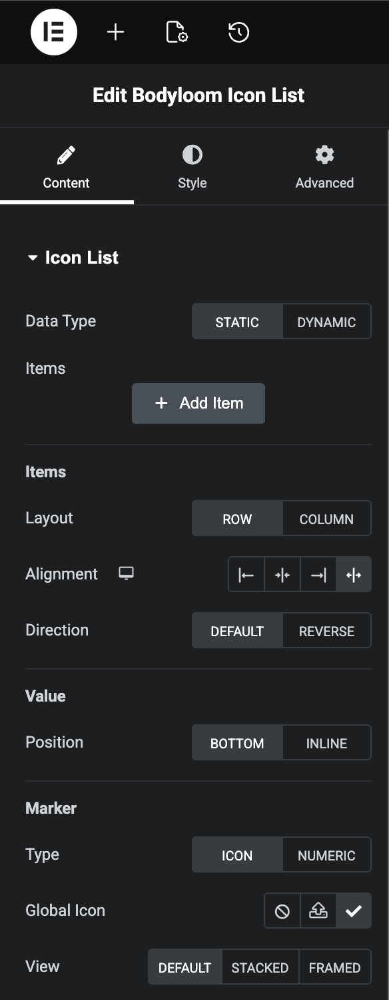
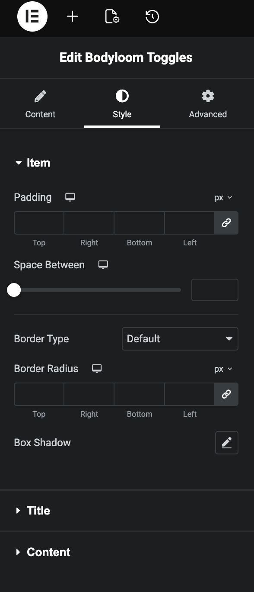
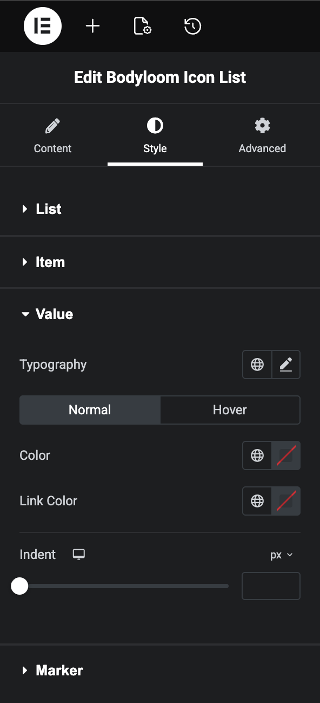
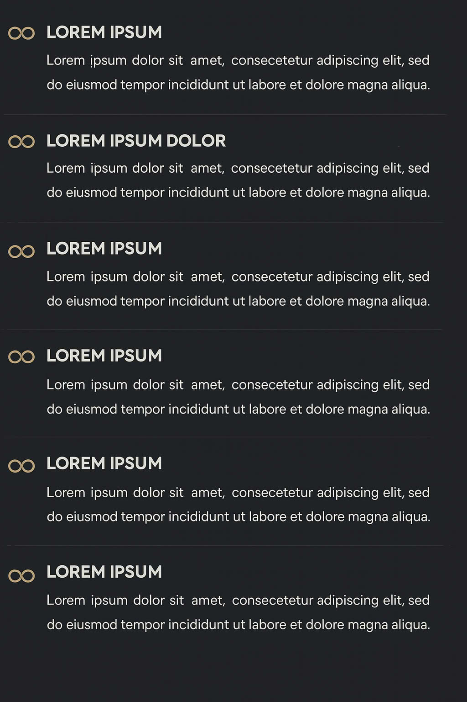

# Bodyloom Icon List

**Contributors:** Jimmy Thanki  
**Tags:** icon list, acf, metabox, pods, elementor  
**Requires at least:** 5.0  
**Tested up to:** 6.7  
**Requires PHP:** 7.4  
**License:** GPLv2 or later  

## Description

Bodyloom Icon List allows you to easily create dynamic icon lists using data from your favorite custom field plugins. Display services, features, pricing, or any other list data with customizable icons and styles.

**Key Features:**
*   **Universal Support:** Works with Elementor, Gutenberg, and Shortcode.
*   **Multi-Provider:** Supports ACF Pro, Meta Box, and Pods.
*   **Dynamic Data:** Fetch list items directly from repeater fields.
*   **Customizable:** Control layout (row/column), icons, colors, spacing, and more.

## Installation

1. Upload `bodyloom-dynamic-icon-list` to the `/wp-content/plugins/` directory.
2. Activate the plugin through the 'Plugins' menu in WordPress.

## Usage

**Elementor:**
Search for the "Bodyloom Icon List" widget and drag it into your layout. Select 'Dynamic' data type and configure your repeal field settings.

**Gutenberg:**
Search for the "Icon List" block and add it to your post or page.

**Shortcode:**
`[bodyloom_icon_list acf_repeater_field_name="my_repeater"]`

## Troubleshooting

**Changes not showing in Elementor?**
If you make changes to the layout or styling controls but don't see them reflected immediately in the Elementor editor:
1.  Go to **Elementor > Tools > Elementor Cache** and click **Clear Files & Data**.
2.  Go to **Elementor > Tools > Sync Library** and click **Sync Library**.

## Changelog

### 1.0.0
*   Initial release.

## Screenshots

*Elementor Elements Panel*

*Content Edit Panel*

*Style Edit Panel 1*

*Style Edit Panel 2*

*Rendered Frontend Example*

